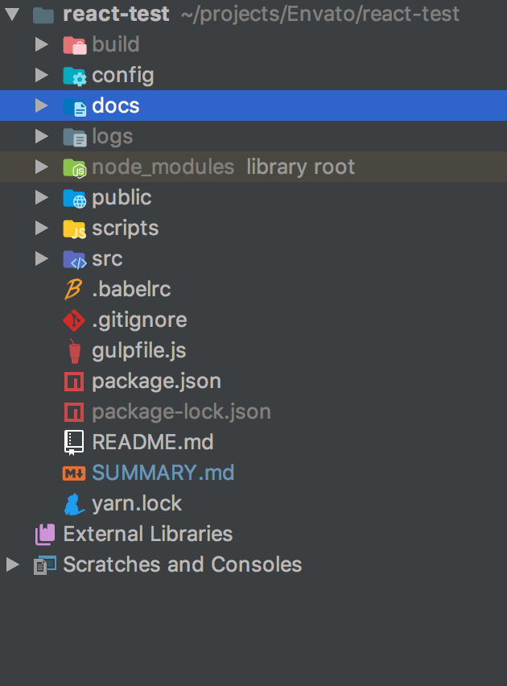

## For buyers

When you bought this product you will have next project structure as follows
(Not all files and folders will be included in sell)

Picture of folder structure

### Desription of folder tree structure
1. **config** - config - webpack configs for React
2. **docs** - .md doc files
3. **public** - folder that contains favicon, index.html and manifest.json
4. **scripts** - scripts that runs application in different modes
5. **src** - Source code folder

###Prerequirements
On your server must be installed:
 - **NodeJS** version > 6
 - **NPM** version > 5
 
### Create you build
You need to go react-test folder in terminal and run next commands:
- npm install
- npm run build
- npm start - le'ts you to start local server with this application

**build** folder will be output folder that you must must pass to your hosting environment which will serve **index.html** inside this folder.

### For developers
If you want to change some code it stored in **src** folder. Also you can write the author of this product.

Author's email **- mihailo.rundenko.main@gmail.com**

