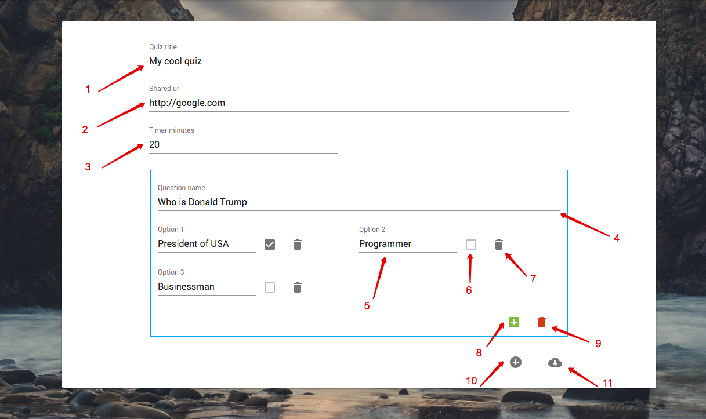

#Configurator documentation

If user wants to create his own quiz he must use **Configurator** page

Screenshot below shows **Configurator** section:

###Explanation

1. **Quiz title** field. **Required**.
2. **Social share url** title field. Must be **valid** url. **Required**.
3. Timer minutes field. Must be **numeric integer number**. **Required**.
4. **Question name** field. **Required**.
5. Question option name field. **Required**.
6. **Question option marker** that it is correct answer. Every question must have only one marker of correct answer. When user mark one option as correct - other markers will be disabled. If user wants to change marker, he must uncheck selected marker and check other.
7. **Delete option button**. It shows when option count more than two. Minimum option count in application is 2. Maximun is 4.
8. **Add option** button.
9. **Delete question button**.
10. **Add question** button.
11. **Generate data source button**. When user clicks on this button quiz data will be validated. If there are no errors then data will be stringified and encrypted and downloaded in file with **.json** extension. This file can be uploaded in **Runner** section to start user own quiz.
