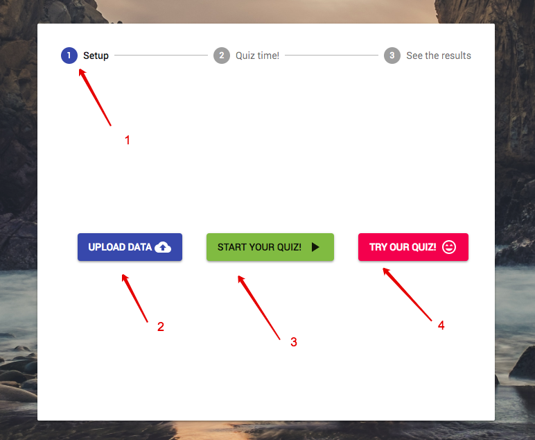
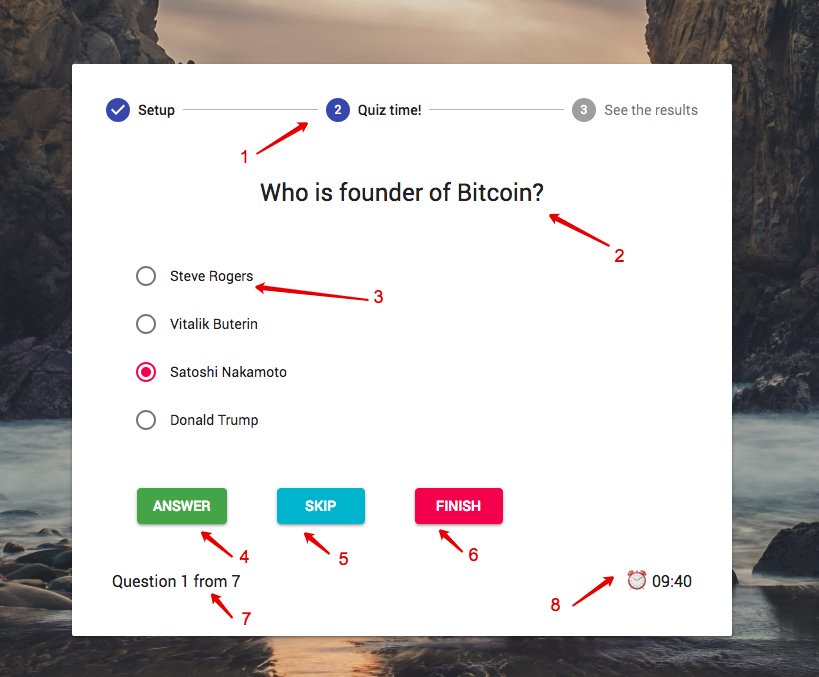
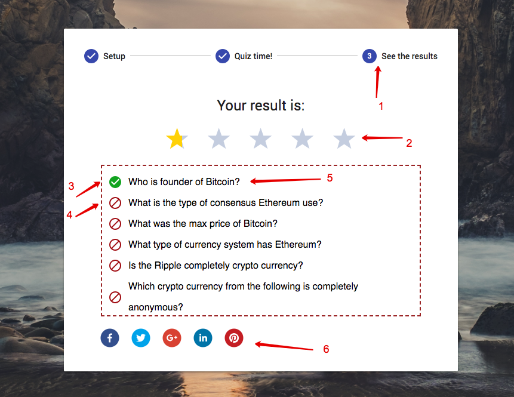

#Runner documentation

If user goes to quiz site the default page will be **Runner** page.
It has three sections: 
- Setup
- Quiz runner
- Results

Screenshot below shows **Setup** section:

###Explanation Setup
1. Current runner step.
2. **Upload data** button. When user clicks on this he must upload his own generated quiz from **Configurator** page.
3. **Start quiz button**. When data is valid this button will enabled and when user clicks on it his quiz will start.
4. **Try our quiz** button. Run default **Crypto quiz** to test your knowledge.

Screenshot below shows **Quiz** section:

###Explanation Quiz
1. Current runner step.
2. Current question title.
3. List of question options. When user select option **Answer button** will be enabled.
4. **Answer button**. When user select option and click on this button there will be next question. If user answers on last question and click on it runner will open **Results** section.
5. **Skip button** User can click on it when he does not select his answer on question. Then question will change to next in quiz.
6. **Finish button** When user clicks on it **Runner** will open **Results** section.
7. Information of currect question number and count of quiz qestion.
8. **Quiz timer** When times ends **Runner** will open **Results** section.

Screenshot below shows **Results** section:

###Explanation Results
1. Current runner step.
2. User score.
3. Question that was answered correctly. 
4. Question that was answered incorrectly or was skipped.
5. Question section. Hover on it will show tooltip of correct answer. 
6. Social share section. Click on it will trigger opening social share modals of social networks. It will provide shareUrl that user created in **Configurator** section
